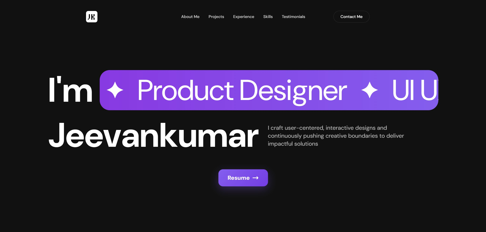
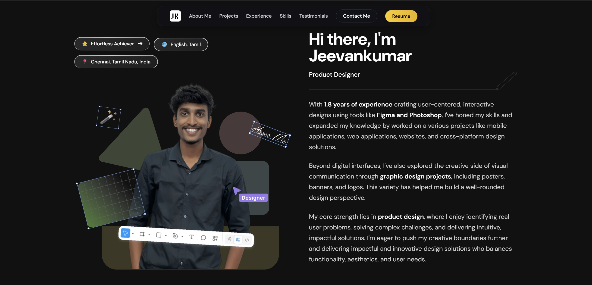
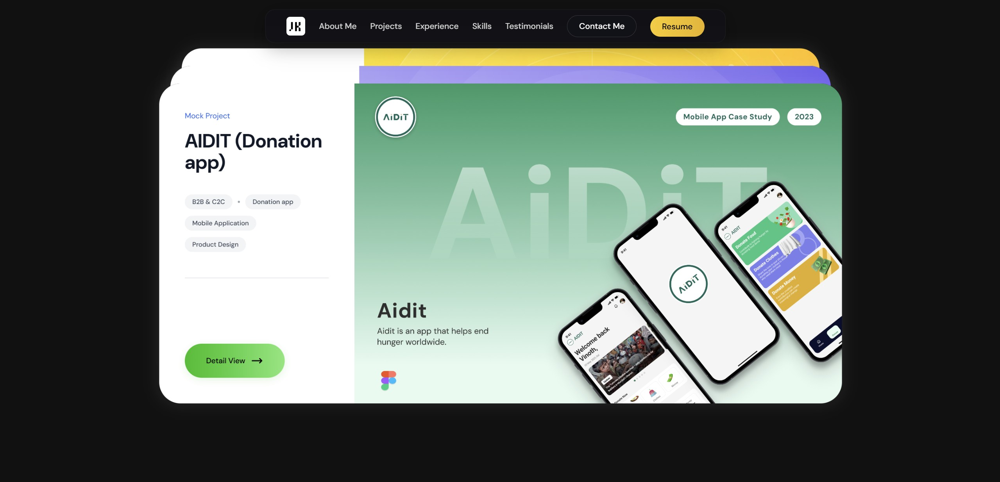
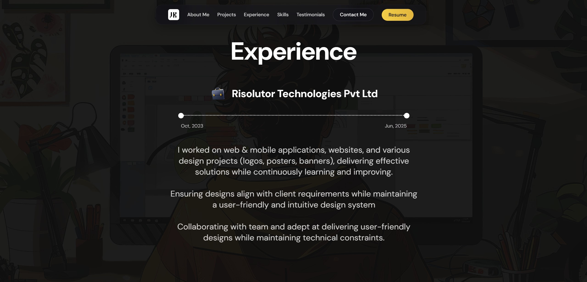
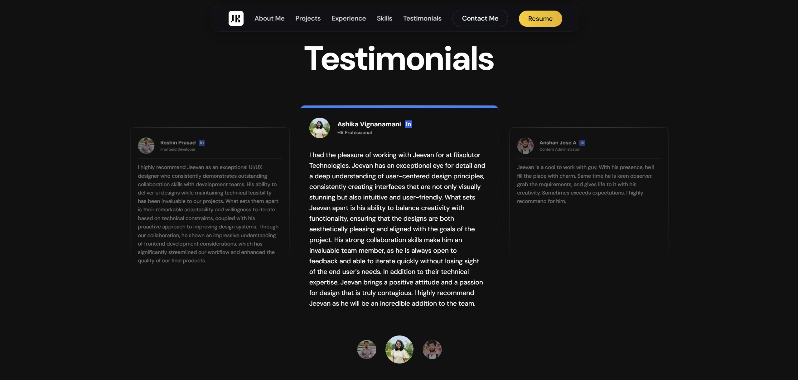

# Jeevankumar Portfolio

A stunning, interactive portfolio website showcasing UI/UX design work through cutting-edge web animations and modern development techniques. This project demonstrates the perfect marriage of creative design and technical excellence.

## 🌟 Live Demo

**🔗 [View Live Portfolio](https://jeevankumark.netlify.app/)**

## � Demo

### Portfolio Showcase

<div align="center">

#### 🎯 Hero Section
*Landing page with animated text and interactive elements*



---

#### 👨‍💻 About Me
*3D interactive about section with parallax effects*



---

#### 🚀 Projects Showcase
*Scroll-stack project cards with depth effects*



---

#### 💼 Experience Timeline
*Animated timeline with progressive reveal*



---

#### 💬 Testimonials
*Auto-rotating carousel with smooth transitions*



</div>

## �📖 About

This portfolio was created to showcase Jeevankumar's UI/UX design expertise through an immersive, interactive web experience. The project pushes the boundaries of modern web development, featuring complex animations, smooth interactions, and performance-optimized design that rivals award-winning websites.

## ✨ Key Features

### 🎨 Advanced Animations
- **Complex Scroll Animations** - GSAP ScrollTrigger for cinematic page transitions
- **3D Interactive Elements** - Mouse-tracking parallax with depth effects
- **Particle Systems** - Custom magnetic interactions and hover effects
- **Canvas Animations** - Custom fuzzy text effects and dynamic visuals
- **Scroll Stack Effect** - Cards that stack and scale during scroll

### 🚀 Performance & Experience
- **Smooth Scrolling** - Lenis integration for buttery-smooth experience
- **Performance Optimized** - 60fps animations across all devices
- **Responsive Design** - Mobile-first approach with adaptive animations
- **Dynamic Theming** - System-based favicon switching

### 🎯 Interactive Components
- **3D Card Hover Effects** - Mouse-tracking with realistic depth
- **Animated Timeline** - Progressive reveal experience section
- **Interactive Testimonials** - Auto-rotating carousel with manual controls
- **Dynamic Navigation** - Morphing navbar states based on scroll
- **Magnetic Button Effects** - Subtle hover interactions throughout

### 🛠️ Technical Excellence
- **Modern React Architecture** - Hooks, performance optimization
- **Cloud-Optimized Assets** - Cloudinary integration for fast loading
- **Analytics Integration** - Google Analytics with scroll depth tracking
- **SEO Optimized** - Proper meta tags and structured data

## 🔧 Tech Stack

- **Frontend Framework:** React.js 19.1.0
- **Animation Libraries:** 
  - GSAP 3.13.0 (ScrollTrigger, Timeline)
  - Framer Motion 12.16.0
- **Smooth Scrolling:** Lenis 1.3.4
- **Styling:** TailwindCSS with custom configurations
- **Asset Management:** Cloudinary
- **Routing:** React Router DOM 7.7.0
- **Analytics:** Google Analytics 4
- **Deployment:** Netlify

## 📁 Project Structure

```
src/
├── components/           # React components
│   ├── Hero.js          # Landing section with animated text
│   ├── About.js         # 3D interactive about section
│   ├── Projects.js      # Scroll-stack project showcase
│   ├── Experience.js    # Animated timeline
│   ├── Skills.js        # Interactive skill tags
│   ├── Testimonials.js  # Rotating testimonial cards
│   ├── Contact.js       # Contact with wave animations
│   ├── Navbar.js        # Dynamic navigation
│   ├── DesignGallery.js # Parallax image gallery
│   ├── MagicBento.js    # Particle effect component
│   ├── FuzzyText.js     # Canvas-based text effects
│   └── CountUp.js       # Animated counters
├── hooks/               # Custom React hooks
│   ├── useAnalytics.js  # Analytics tracking
│   └── useDynamicFavicon.js # Theme-based favicon
├── utils/               # Utility functions
│   └── analytics.js     # GA4 integration
└── App.js              # Main application with Lenis setup
```

## 🚀 Getting Started

### Prerequisites
- Node.js (v16 or higher)
- npm or yarn

### Installation

1. **Clone the repository**
   ```bash
   git clone https://github.com/rahulsuresh2569/Jeevankumar-Portfolio.git
   cd Jeevankumar-Portfolio
   ```

2. **Install dependencies**
   ```bash
   npm install
   ```

3. **Start development server**
   ```bash
   npm start
   ```

4. **Open your browser**
   Navigate to `http://localhost:3000`

### Build for Production

```bash
npm run build
```

## 🎯 Performance Optimizations

- **Hardware Acceleration** - Transform3d and will-change properties
- **Lazy Loading** - Images and components load on demand
- **Animation Cleanup** - Proper GSAP timeline disposal
- **Mobile Optimizations** - Reduced animation complexity on mobile
- **Asset Optimization** - Cloudinary automatic optimization
- **Code Splitting** - React Router-based lazy loading

## 📱 Responsive Design

The portfolio is fully responsive with breakpoint-specific optimizations:
- **Mobile (< 768px):** Simplified animations, touch-optimized interactions
- **Tablet (768px - 1024px):** Balanced animation complexity
- **Desktop (> 1024px):** Full animation suite with 3D effects

## 🔍 Browser Support

- Chrome (recommended)
- Firefox
- Safari
- Edge
- Mobile browsers (iOS Safari, Chrome Mobile)

## 📊 Analytics & Tracking

- Page view tracking
- Scroll depth measurement
- Performance monitoring
- User interaction analytics

## 🤝 Contributing

This is a portfolio project, but feedback and suggestions are welcome! Feel free to:
- Report bugs via issues
- Suggest improvements
- Share performance insights

## 👨‍💻 Developer

**Built by:** [Rahul Suresh](https://github.com/rahulsuresh2569)
**Design by:** Jeevankumar (UI/UX Designer)

## 📄 License

This project is licensed under the MIT License - see the [LICENSE](LICENSE) file for details.

## 📞 Contact

- **Portfolio Owner:** [Jeevankumar's Portfolio](https://jeevankumark.netlify.app/)
- **Developer:** [GitHub](https://github.com/rahulsuresh2569)

---

⭐ If this project inspired you or helped in your learning journey, please consider giving it a star!
